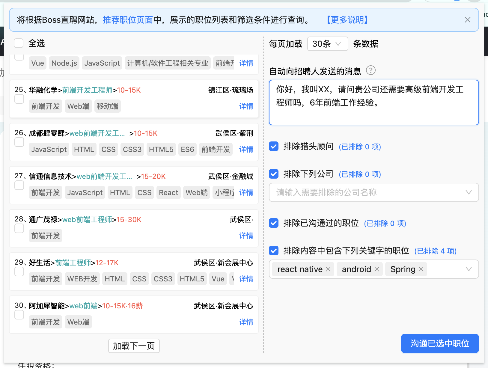
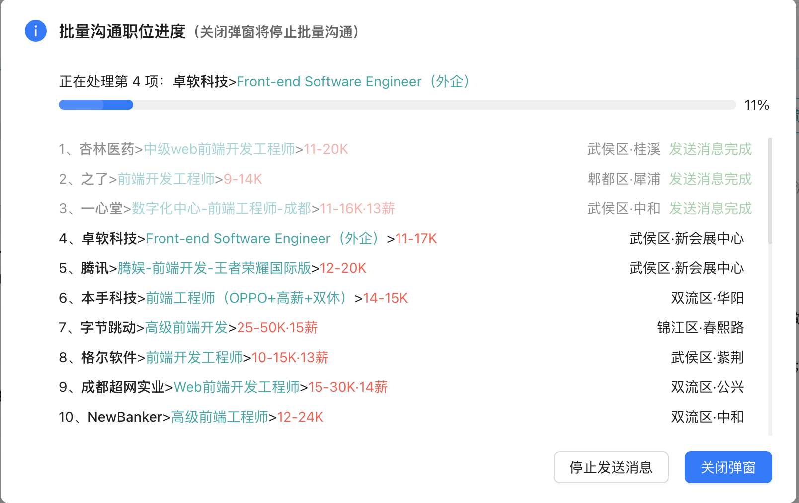

### BOSS_Batch_Deliver

BOSS 直聘 批量沟通职位 chrome 插件，将根目录下 “dist.zip” 下载并解压后，在 chrome://extensions/ 插件管理页面加载即可使用。

### 帮助说明

1. 当您跳转到 BOSS 直聘推荐职位页面后，页面会展示【推荐职位】或您自己添加【求职期望】，这时候打开插件，职位列表就是当前网站中展示职位列表。

2. 在添加自定义打招呼消息文案后，然后开始批量沟通已选中职位，这时候会自动打开一个最小化浏览器窗口帮您自动发送沟通消息。

3. 如果你在平台配置过【打招呼语】，那么将不会使用在插件中配置的自定义消息。并且批量沟通的进度也比发送自定义消息要快，因为会少几个处理步骤。

4. 如果在使用过程中出现问题，您可以尝试网页或重新加载插件。

5. 本插件不会记录和获取你在招聘平台的任何用户信息，请放心使用。
   这是插件的代码仓库地址：[Github](https://github.com/wvit/BOSS_batch_deliver.git) 或 [Gitee](https://github.com/wvit/BOSS_batch_deliver.git)

### 插件预览

